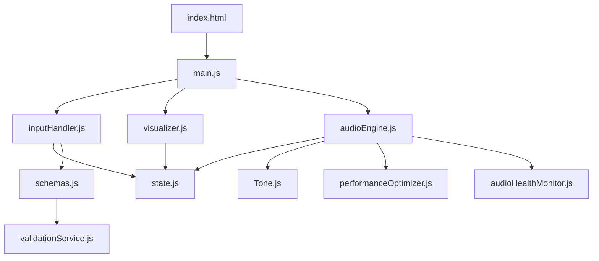

# Codebase Map

Quick reference for navigating the Music2 codebase.

## File Responsibilities

### Core Audio (`src/`)
| File | Lines | Responsibility | Refactor Priority |
|------|-------|----------------|-------------------|
| `audioEngine.js` | 1774 | ⚠️ EVERYTHING - instruments, effects, playback, live input | 🔴 URGENT |
| `musicConfig.js` | 520 | Example songs, genre templates | 🟡 Medium |
| `schemas.js` | 162 | Zod validation schemas | 🟢 Good |
| `state.js` | 49 | Simple pub/sub state management | 🟡 Medium |

### UI & Visualization (`src/`)
| File | Lines | Responsibility | Dependencies |
|------|-------|----------------|--------------|
| `inputHandler.js` | 303 | JSON editor, UI controls | state, audioEngine |
| `visualizer.js` | 274 | Main track visualization | state, audioEngine |
| `audioVisualizer.js` | 94 | Spectrum analyzer | Tone.js |
| `visualizerComponents.js` | 682 | Advanced visualizations | Tone.js |

### Effects & Processing (`src/`)
| File | Lines | Responsibility | Notes |
|------|-------|----------------|-------|
| `effectPresets.js` | 186 | Effect chain presets | Static data |
| `effectPresetUI.js` | 127 | Effect preset UI | Uses effectPresets |
| `liveChainBuilder.js` | 336 | Drag-drop effect UI | Modifies live chain |

### Utilities (`src/`)
| File | Lines | Responsibility | Usage |
|------|-------|----------------|-------|
| `validationService.js` | 42 | JSON validation | Input validation |
| `performanceOptimizer.js` | 159 | Performance tuning | Auto-optimizes |
| `audioHealthMonitor.js` | 171 | Audio health tracking | NEW - monitors clipping |

### New Refactoring Utilities (`src/utils/`)
| File | Purpose | Usage |
|------|---------|-------|
| `DisposalRegistry.js` | Memory leak prevention | Register all Tone.js objects |
| `memoryMonitor.js` | Memory leak detection | Development only |

### Configuration Files
| File | Purpose | Key Settings |
|------|---------|--------------|
| `vitest.config.js` | Test configuration | Uses happy-dom |
| `.eslintrc.js` | Code quality | JSDoc required |
| `.prettierrc.js` | Code formatting | 2 spaces, single quotes |

### Documentation
| File | Purpose | When to Read |
|------|---------|--------------|
| `CLAUDE.md` | AI assistant guide | 📖 READ FIRST |
| `REFACTORING_PLAN.md` | Refactoring roadmap | Before major changes |
| `CONTRIBUTING.md` | Contribution guide | Before contributing |

## Key Relationships



## Import Hierarchy

### Level 1 (No dependencies)
- `schemas.js`
- `effectPresets.js`
- `utils/DisposalRegistry.js`
- `utils/memoryMonitor.js`

### Level 2 (Basic dependencies)
- `validationService.js` → schemas
- `state.js` → (standalone)
- `performanceOptimizer.js` → (standalone)
- `audioHealthMonitor.js` → (standalone)

### Level 3 (Core modules)
- `audioEngine.js` → Tone.js, performanceOptimizer, state, audioHealthMonitor
- `effectPresetUI.js` → effectPresets

### Level 4 (UI layer)
- `inputHandler.js` → validationService, state, schemas, audioEngine, liveChainBuilder, effectPresetUI
- `visualizer.js` → state, audioEngine
- `liveChainBuilder.js` → (standalone UI)

### Level 5 (Entry point)
- `main.js` → ALL modules

## Data Flow

1. **User Input** → `inputHandler.js` → `validationService.js` → `state.js`
2. **State Change** → `audioEngine.js` → Tone.js
3. **Audio Events** → `visualizer.js` → Canvas rendering
4. **Live Input** → `audioEngine.js` → `liveChainBuilder.js` → Effects

## Memory Hotspots 🔥

1. **audioEngine.js**:
   - `effects` Map - not always cleaned
   - `temporaryEffects` Map - per-note effects
   - `instruments` Map - holds Tone.js objects
   - Live input chain - dynamic effects

2. **visualizer.js**:
   - Animation frames
   - Canvas contexts
   - Event listeners

3. **liveChainBuilder.js**:
   - Drag-drop listeners
   - Dynamic DOM elements

## Refactoring Targets

### Phase 1: Split audioEngine.js
```
audioEngine.js →
├── audio/core/Transport.js (lines 1090-1250)
├── audio/instruments/Factory.js (lines 457-1046)
├── audio/effects/Factory.js (lines 59-274)
├── audio/live/LiveInput.js (lines 1251-1456)
└── audio/core/MasterBus.js (lines 1636-1733)
```

### Phase 2: Centralize State
```
state.js + various states →
└── state/Store.js (unified state management)
```

### Phase 3: Type Safety
```
Add JSDoc → TypeScript declarations →
└── types/index.d.ts
```

## Quick Commands

```bash
# Find all Tone.js usage
grep -r "new Tone\." src/

# Find all effects
grep -r "availableEffects" src/

# Find memory leaks
grep -r "addEventListener\|setInterval\|setTimeout" src/

# Find disposal calls
grep -r "dispose()" src/
```